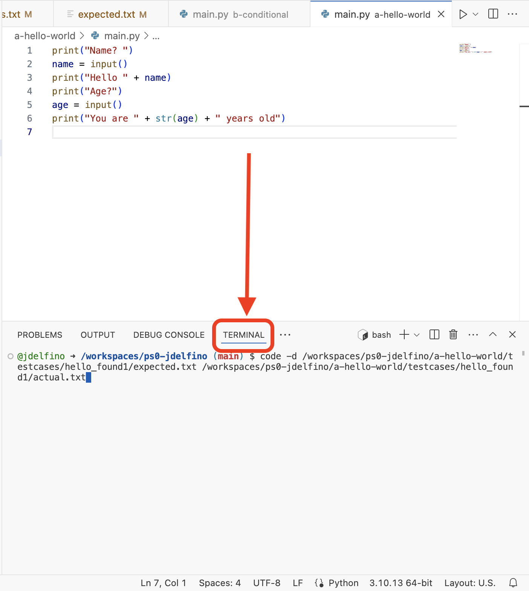

# Assignments

Assignments are contained in the `assignments` directory. There is one directory per assignment. Each assignment has specific instructions in the `README.md` file in the assignment directory.

For most assignments, you will be editing the file named `main.py` in the assignment directory. The instructions will explicitly note if other files need to be edited.

## Editing and running code

Click on `main.py` in an assignment directory to open it. You can test your code manually by clicking the `Run` button at the top left of the text editor.


## Submitting

**Don't forget to run automated tests before submitting!**

To submit:
1. Click on the `Source Control` icon on the left side of the screen
2. Type a message in the "Message" box (or click on the "Auto commit message" button above the text box to generate one automatically).
    * The content of the message is not important, but you can use it as a place to note things about your submission.
3. Click "Commit & Push"
4. You can submit as many times as you want, up to the deadline. Your most recent submission before the deadline will be graded.


# Testing

You can always test your code manually by clicking on the `Run` button at the top right of the editor when you have a Python file open.

Most assignments also come with automated tests. To run them, click on the `Testing` icon on the left side of VSCode, then click the "play" button on the test or tests you want to run.


**If you submit with any automated tests failing, you will not receive full credit for the assignment.**  Part of the challenge of the assignments is to make your code generate the output the tests are expecting. If your tests are failing - even if the failure seems trivial to you - you should try to fix them before submiting. Get help from the course staff if you feel stuck!

## Input / output tests

Input/output tests send input to your program, and ensure that your program produces the expected output.
The actual output must match the expected output (almost) exactly - only blank lines are ignored.

### Understanding failures

Input/output test failures contain a lot of important information, but also a lot of information you can ignore.

<details>
  <summary>Full example output</summary>
  
```
/workspaces/ps0-jdelfino/a-hello-world/test_main.py::test_hello_world[case0] failed: case = PosixPath('/workspaces/ps0-jdelfino/a-hello-world/testcases/hello_found1')

    @pytest.mark.parametrize("case", harness.find_cases())
    def test_hello_world(case):
>       harness.execute(case)

a-hello-world/test_main.py:6: 
_ _ _ _ _ _ _ _ _ _ _ _ _ _ _ _ _ _ _ _ _ _ _ _ _ _ _ _ _ _ _ _ _ _ _ _ _ _ _ _ 

testcase_dir = PosixPath('/workspaces/ps0-jdelfino/a-hello-world/testcases/hello_found1')
mainfile_relpath = 'main.py'

    def execute(testcase_dir, mainfile_relpath='main.py'):
        caller_dir = pathlib.Path(inspect.stack()[1][1]).parent
        mainfile =  caller_dir / mainfile_relpath
    
        expected_file = testcase_dir / 'expected.txt'
        actual_file = testcase_dir / 'actual.txt'
        input_file = testcase_dir / 'input.txt'
    
        with open(expected_file.resolve(), 'r') as exfile:
            expected = [x.strip() for x in exfile.readlines()]
        with open(input_file, 'r') as inpfile:
            inp = [x.strip() for x in inpfile.readlines()]
    
        child = pexpect.spawn(f'python {mainfile.resolve()}', echo=False)
        for i in inp:
            child.sendline(i)
    
        actual = [x.strip() for x in child.read().decode('ascii').split('\r\n') if x]
        with open(actual_file, 'w') as outfile:
            outfile.writelines([x + '\n' for x in actual])
    
>       assert actual == expected, f"Comparison failed, run this command to see the differences:\ncode -d {expected_file} {actual_file}"
E       AssertionError: Comparison failed, run this command to see the differences:
E         code -d /workspaces/ps0-jdelfino/a-hello-world/testcases/hello_found1/expected.txt /workspaces/ps0-jdelfino/a-hello-world/testcases/hello_found1/actual.txt
E       assert == failed. [pytest-clarity diff shown]
E         
E         LHS vs RHS shown below
E         
E         ['Name?', 'Hello Alan', 'Age?', 'You are 20 years old']
E         ['Name?', 'Hello Alan', 'Age?', 'You are 20 years old.']
E         

/home/codespace/.python/current/lib/python3.10/site-packages/iotest/harness.py:33: AssertionError
```
</details>
<br/>
In that long output, only the very end is interesting:

```
E       AssertionError: Comparison failed, run this command to see the differences:
E         code -d /workspaces/ps0-jdelfino/a-hello-world/testcases/hello_found1/expected.txt /workspaces/ps0-jdelfino/a-hello-world/testcases/hello_found1/actual.txt
E       assert == failed. [pytest-clarity diff shown]
E         
E         LHS vs RHS shown below
E         
E         ['Name?', 'Hello Alan', 'Age?', 'You are 20 years old']
E         ['Name?', 'Hello Alan', 'Age?', 'You are 20 years old.']
E         
```

We can see 2 important things here:
1. The difference between the "LHS" ("left hand side", or the expected output) and the "RHS" ("right hand side", or the actual output).
    * In this example, the actual output has an unexpected period on the last line.
2. A command that we can run to see a more user-friendly comparison. The command is the entire line that starts with `code -d ...`. To run it:
    1. Copy the entire `code -d ...` command.
        * 
    2. Open up the `Terminal` tab in the bottom pane of the editor.
        * 
    3. Paste the command and press enter. A side-by-side diff of the expected vs. actual output will appear.
        * 
